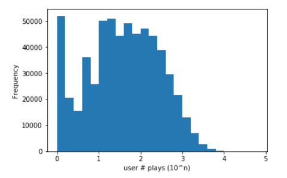
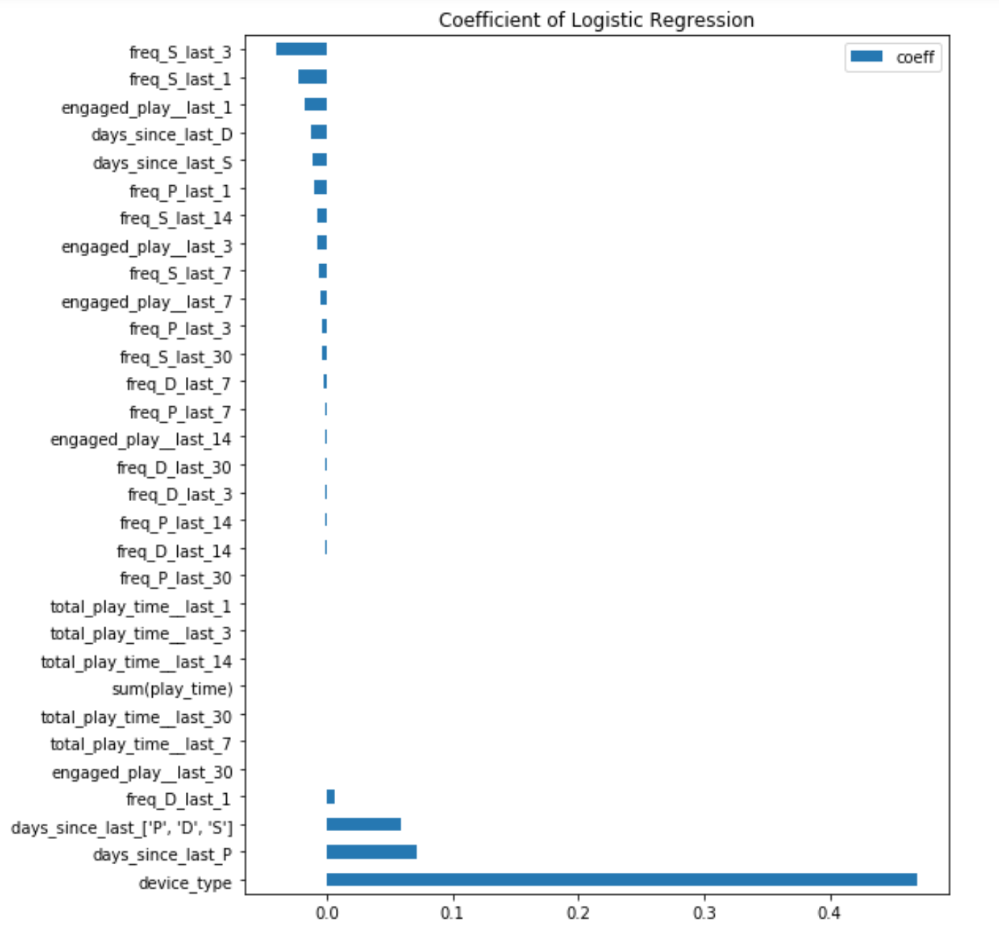
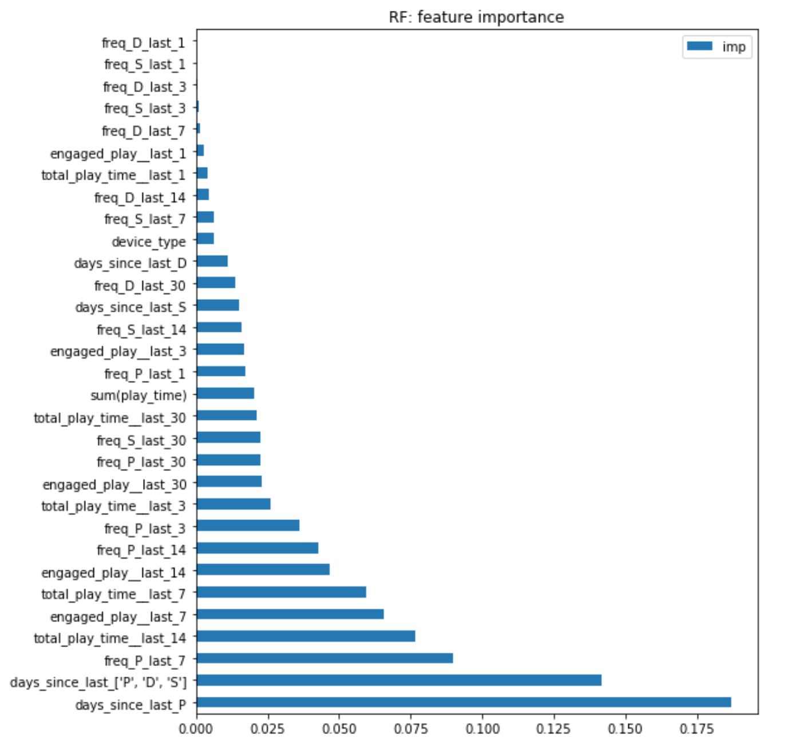
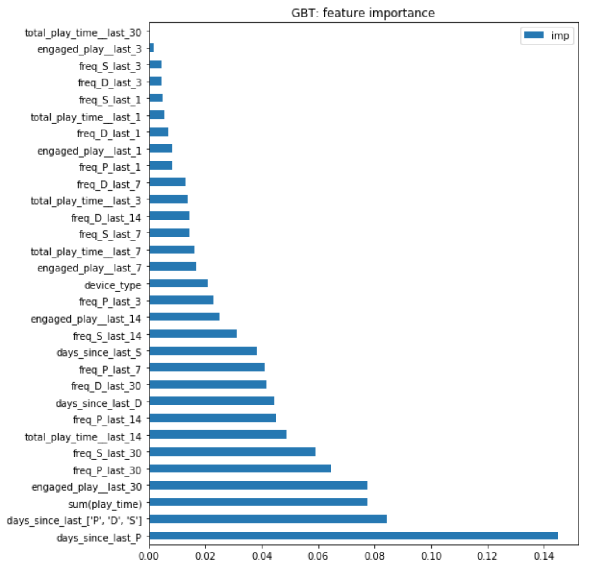
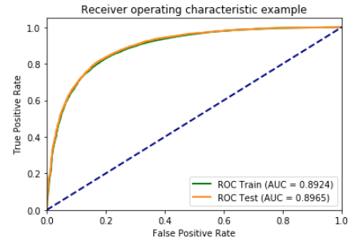
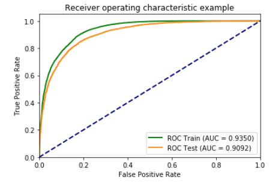
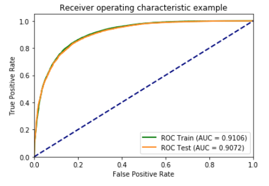
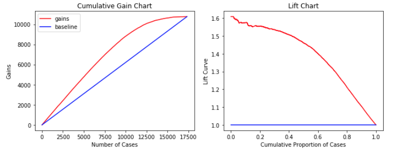
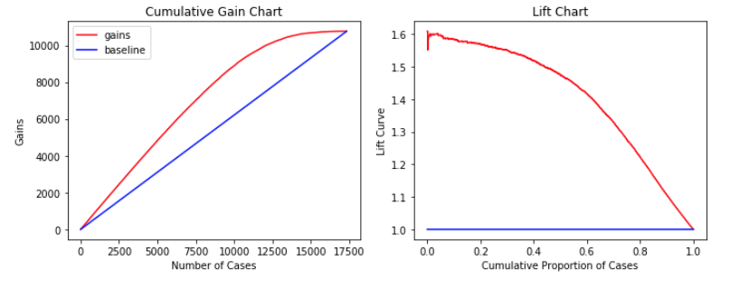
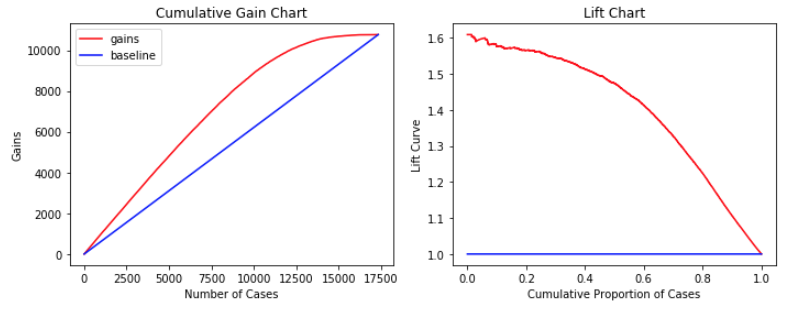

# Music Box Churn Prediciton and Recommendation (Spark)

## Introduction
- Data provider  
One of the top three music streaming services in China.  
- Goals  
Use the log files to build churn prediction model and a recommender system.  

## Data
- Date range  
From 2017-03-01 to 2017-05-12.  
Continuous data without missing days from 2017-03-30 to 2017-05-12.
- File types and schemas    
**\<Date\>_\<index\>_play.log**

|uid|device|song_id|song_type|song_name|singer|play_time|song_length|paid_flag|
|:-:|:-:|:-:|:-:|:-:|:-:|:-:|:-:|:-:|
|long|string|long|int|string|string|int|int|int|

**\<Date\>_\<index\>_down.log**

|uid|device|song_id|song_name|singer|paid_flag|
|:-:|:-:|:-:|:-:|:-:|:-:|
|long|string|long|string|string|int|

**\<Date\>_\<index\>_search.log**

|uid|device|time_stamp|search_query (encrypted)|
|:-:|:-:|:-:|:-:|
|long|string|timestamp|string|

## Churn Prediction :white_check_mark:

### 1. Define Churn   
Inactive in fixed window (outcome window) 0/1   
Fixed window can be e.g. last 2 weeks (4/29-5/12)   

### 2. Population  
Inclusion: 3/30-4/28 all active users   
Exclusion: inactive user observation window, bots    

### 3. Data Processing
**0. Down load and merge data**  
Run "src/0_create_data_folders.sh", "src/1_download_data.ipynb", "src/2_unpack_and_clean_files.sh" to download all the data and create three merged data files: "data/serach/all_search_log", "data/down/all_down_log" and "data/play/all_play_log".   
**1. Down-sampling**  
Run "src/3_etl_down_sample_by_user.ipynb" to: 
1. Remove bot users. 
   Some extreme play behavior is considered as the plays by bots. In this case the users who have number of plays over 99 percentile are considered as bots and are removed from the analysis. The following chart is the histogram of number of plays at log scale by each users.     
   
2. Perform down-sampling to get 10% of the remaining 594139 unique users.  
3. Concatenate the three events (download, play, search) to a file. The number of rows in the result file is 12,331,951.   

**2. Label definition**  
label window: From 2017-04-29 to 2017-05-12 days: 14  

**3. Feature Generation**   
feature window: From 2017-03-30 to 2017-04-28 days: 30  
- Frequency (of Events over Time Window):  
  - Window (Number of Days): 1, 3, 7, 14, 30  
  - Type of Events: Play (P), Download (D), Search (S)   
  - Number of features: 5 time ranges * 3 types = 15 features   
  - Feature names:  
'freq_P_last_1', 'freq_P_last_3', 'freq_P_last_7' 'freq_P_last_14', 'freq_P_last_30',  
 'freq_D_last_1', 'freq_D_last_3', 'freq_D_last_7', 'freq_D_last_14', 'freq_D_last_30',  
 'freq_S_last_1', 'freq_S_last_3', 'freq_S_last_7','freq_S_last_14', 'freq_S_last_30'

- Recency (of Events)  
Days since last event including: Play, Download, Search, or any of these three types of events    
Number of features: 4 features   
Feature names:  
 'days_since_last_P',
 'days_since_last_D',
 'days_since_last_S',  
 "days_since_last_['P', 'D', 'S']"  

- Play Time  
  - play time in over Time Window: Window (Number of Days): 1, 3, 7, 14, 30, life_time  
  - Number of features: 6  
  - Feature names: 'total_play_time__last_1', 'total_play_time__last_3','total_play_time__last_7', 'total_play_time__last_14', 'total_play_time__last_30', 'sum(play_time)'  
- Engaged play (played 80% song duration)  
  - play time in over Time Window: Window (Number of Days): 1, 3, 7, 14, 30
  - Number of features: 5
  - Feature names: 'engaged_play__last_1',
 'engaged_play__last_3',
 'engaged_play__last_7',
 'engaged_play__last_14',
 'engaged_play__last_30'  
- Device  
  - Android: 2, IOS: 1
  - Number of features: 1
  - Feature name: 'device_type' 
<!-- - Acceleration  
Ratio of frequency of different time window (acceleration)    
e.g. • play_1d_over_play_7d, play_1d_over_down_1d, play_1d_over_down_7d ...  

- Rate (Not Applicable)   
e.g. Click given impression. click / impression  

- Life length (Not Applicable)  
Days since last subscription.  

- Play time percentage of song length   
mean, max, min, std, mean weighted by recency   -->

### 4. Train Model
Since we are predicting the churn label we used three supervised models in this study.   
- Logistic Regression with Regularization  
  Logistic regression is very popular model in binary classification because of its fast processing time and explainable coefficients. For example from the coefficient plot, we can find that device_type(IOS:1, Android:2) has the greatest coefficient which means the the users with Android device are more likely to churn. And most frequency features have negative coefficients, which means the higher the frequency the lower the churn. It matches with our intuition.  
        

- Random Forest and Gradient Boosting Trees  
  These two models have the ability to reduce the effect of colliearity and catch non-linear relation between reponses and features.   
  These two models give us similar feature importance. The most import two features are "days_since_last_P" and "days_since_last_['P', 'D', 'S']" in both cases. And the frequency features with shorter time windows tend to have lower importances.   
        
        

### 5. Validation 
- ROC  
From the following ROC curves for each models, we can see that random forest beats the other models with AUC=0.9092 on test set. But the differences between each models' AUC are not that significant. The ROC curves of random forest are quite different during training and testing while the other two models shows consistent performance.
    - Logistic Regression  
    
    - Random Forest   
    
    - GBDT   
    

- [Gain and Lift Curve](http://www2.cs.uregina.ca/~dbd/cs831/notes/lift_chart/lift_chart.html)  
Lift is a measure of the effectiveness of a predictive model calculated as the ratio between the results obtained with and without the predictive model.  
The lift curves of each models are quite similar where the maximum lift is about 1.6. The fluctuation from the random forest's lift chart indicates that we might have trouble with top predicted churn probability.
    - Logistic Regression
    
    - Random Forest
    
    - GBDT
    
    
### 6. Summary  
Based on the ROC curve we can choose random forest as our final model to use. However, this might not be true in the real life for the following reasons:  
1. The churn definition used in this study is not realistic. Due to the lack of data problem, we defined churn as the inactive behavior for very short prediod (2 weeks). The consequence is that many of users are labeld as this fake churn. We can have modify this churn definition if we have big amount of data.  
2. The data has been down-sampled for the sake of computation convenience. This sample might not represent the population well. We can either perform more reasonable sampling or use the whole data to perform the accurate analysis.  

## Recommendation :arrows_counterclockwise:
- Validate dataset, identify missing values and find inconsistencies in the dataset.  
- Perform data cleaning and transformation, and construct utility matrix from user behavior data  
- Define implicit ratings from user behavior data  
- Build music recommendation system based on user listening
history, including: popularity-based recommender, item-item based recommender, matrix factorization-based recommender.   
