## Advanced Lane Finding
---

**Advanced Lane Finding Project**

The goals / steps of this project are the following:

* Compute the camera calibration matrix and distortion coefficients given a set of chessboard images.
* Apply a distortion correction to raw images.
* Use color transforms, gradients, etc., to create a thresholded binary image.
* Apply a perspective transform to rectify binary image ("birds-eye view").
* Detect lane pixels and fit to find the lane boundary.
* Determine the curvature of the lane and vehicle position with respect to center.
* Warp the detected lane boundaries back onto the original image.
* Output visual display of the lane boundaries and numerical estimation of lane curvature and vehicle position.
* [Rubric points](https://review.udacity.com/#!/rubrics/571/view)

---

### Camera Calibration

The code for this step is contained in the first markdown cell of the IPython notebook located in "advanced_lane_finding.ipynb".  

The calibration is based on the corners of 10×7 chessboard images by cv2.findChessboardCorners() function and calculating the matrix by cv2.calibrateCamera() function.

I start by preparing "object points", which will be the (x, y, z) coordinates of the chessboard corners in the world. Here I am assuming the chessboard is fixed on the (x, y) plane at z=0, such that the object points are the same for each calibration image.  Thus, `objp` is just a replicated array of coordinates, and `objpoints` will be appended with a copy of it every time I successfully detect all chessboard corners in a test image.  `imgpoints` will be appended with the (x, y) pixel position of each of the corners in the image plane with each successful chessboard detection.  

I then used the output `objpoints` and `imgpoints` to compute the camera calibration and distortion coefficients using the `cv2.calibrateCamera()` function.  I applied this distortion correction to the test image using the `cv2.undistort()` function and obtained this result: 

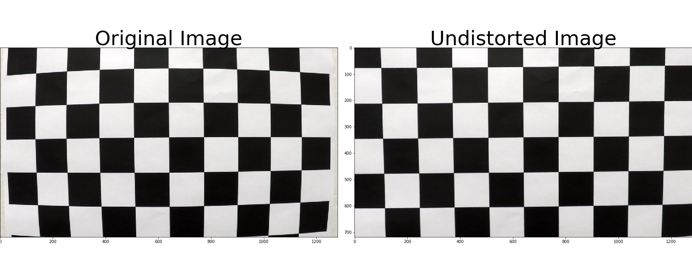

### Pipeline (single images)

#### 1. Correct distortion.

To demonstrate this step, I will describe how I apply the distortion correction to one of the test images like this one:  
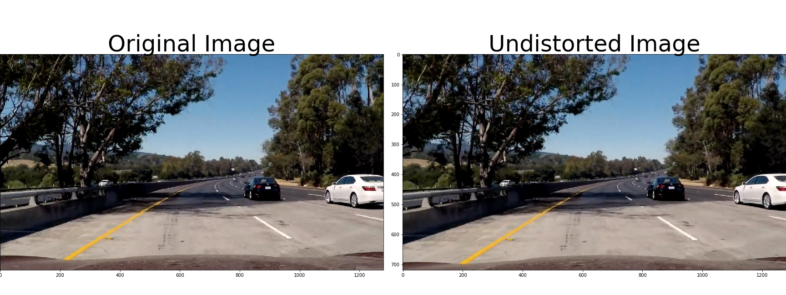

#### 2. Create a thresholded binary image. 

I used a combination of HLS color space and gradient thresholds to generate a binary image (thresholding steps in the third cell in "advanced_lane_finding.ipynb").  Here's an example of my output for this step.  

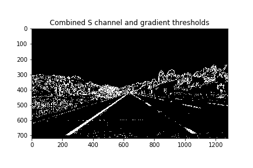

#### 3. Performed a perspective transform.

The code for my perspective transform includes a function called `warp()`, which appears in the third cell in the IPython notebook file. The `warp()` function takes as inputs an image (`img`), as well as source (`src`) and destination (`dst`) points.  I chose the hardcode the source and destination points in the following manner:

```python
# Four source coordinates
src = np.float32(
[[684, 450],#top right
[1100, 720],#bottom right
[200, 720],#bottom left
[596, 450]])#top left

# Four desired coordinate
dst = np.float32(
[[950, 0],#top right
[950, 720],#bottom right
[410, 720],#bottom left
[410, 0]])#top left
```

This resulted in the following source and destination points:

| Source        | Destination   | 
|:-------------:|:-------------:| 
| 684, 450      | 950, 0       | 
| 1100, 720      | 950, 720      |
| 200, 720     | 410, 720      |
| 596, 450      | 410, 0        |

I verified that my perspective transform was working as expected by drawing the `src` and `dst` points onto a test image and its warped counterpart to verify that the lines appear parallel in the warped image.

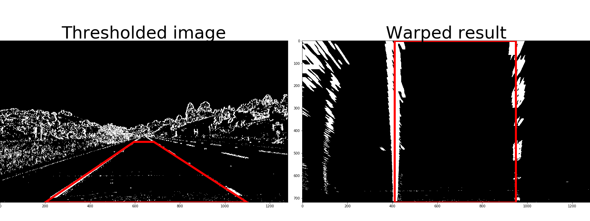

#### 4. Identify lane-line pixels and fit their positions with a polynomial.

First I fit the polynomial functions(f(y)=Ay^2
 +By+C) to left line and right line by finding the peak in histogram of windowing area.

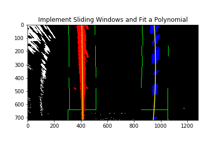

Then I use this fitted polynomial to search in a margin around the previous line position.  

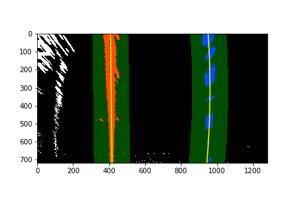

#### 5. Calculated the radius of curvature of the lane and the position of the vehicle with respect to center.

I did this in fit_poly() and curvature() function in cell 3 in the Ipython file

The radius of curvature (awesome tutorial here) at any point xx of the function x = f(y)x=f(y) is given as follows:

$\LARGE R_{curve} = \frac{[1 + (\frac{dx}{dy})^2]^{3/2}}{|\frac{d^2x}{dy^2}|}$	

In the case of the second order polynomial above, the first and second derivatives are:

$\large f'(y) = \frac{dx}{dy} = 2Ay + B

$\large f''(y) = \frac{d^2x}{dy^2} = 2A$

So, our equation for radius of curvature becomes:

$\LARGE R_{curve} = \frac{(1 + (2Ay + B)^2)^{3/2}}{\left |2A \right |}$

Vehicle position is calculated by assuming the camera is mounted at the center of the car. Then the offset of the lane center from the center of the image (converted from pixels to meters) is your distance from the center of the lane.

And the real life distance is calculated by the following mapping

| Source        | Destination   | 
|:-------------:|:-------------:| 
| meters per pixel in y dimension     | 30m/720 pixel       | 
| meters per pixel in x dimension     | 3.7m/700 pixel      | 


​	
#### 6. Example image of your result plotted back down onto the road such that the lane area is identified clearly.

I implemented this step in cell 3 in the Ipython file `draw_lines()`.  Here is an example of my result on a test image:

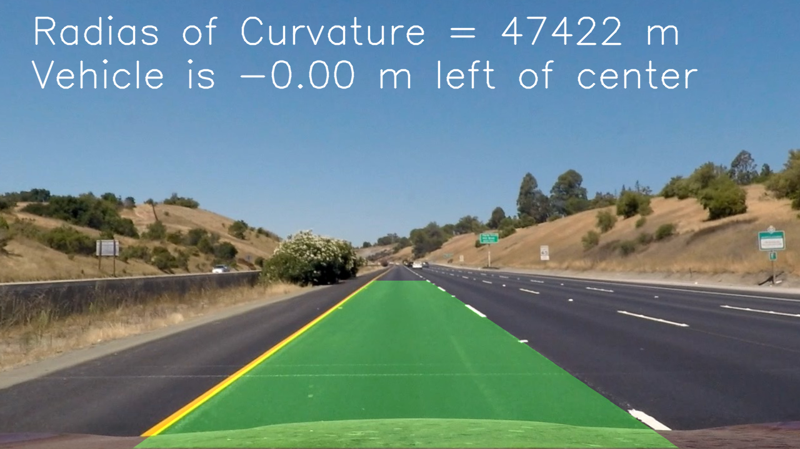
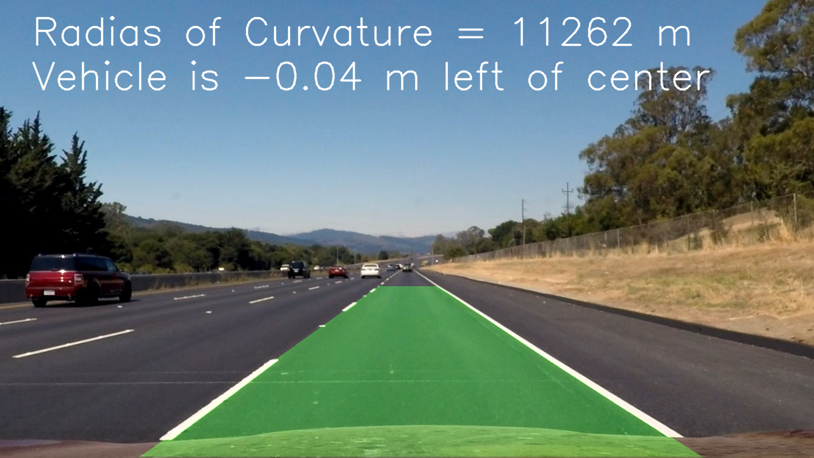
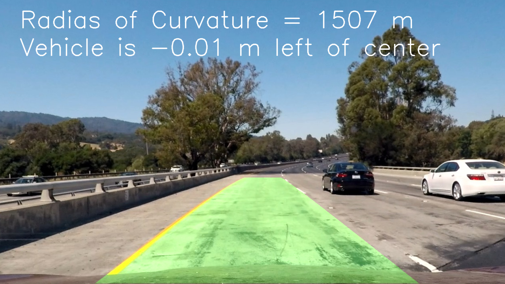
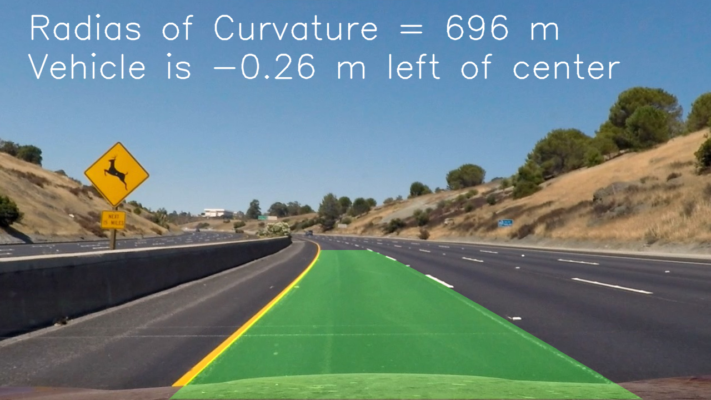
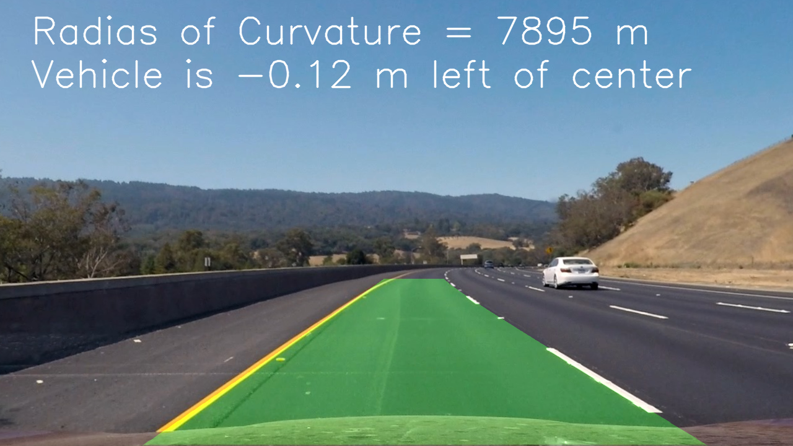
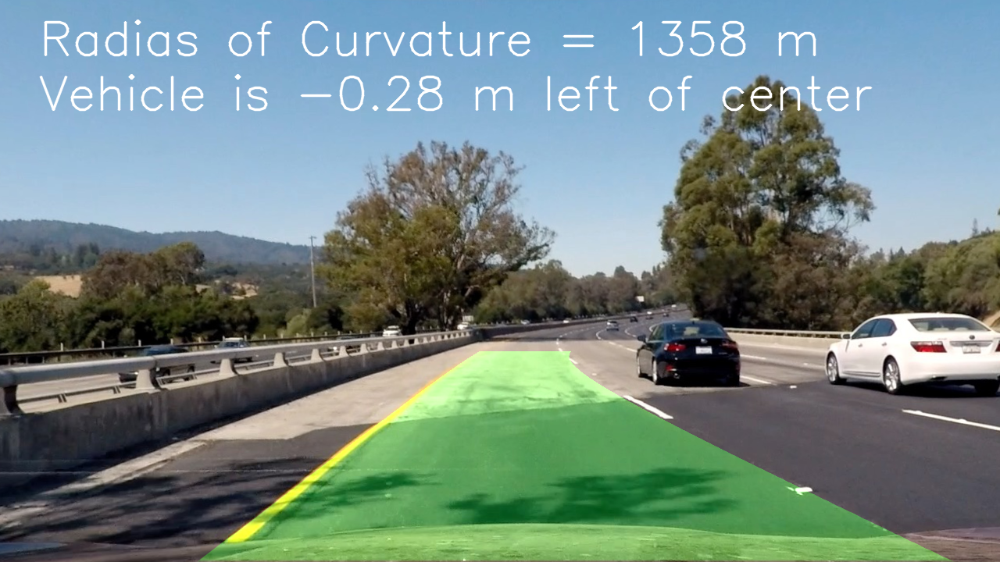
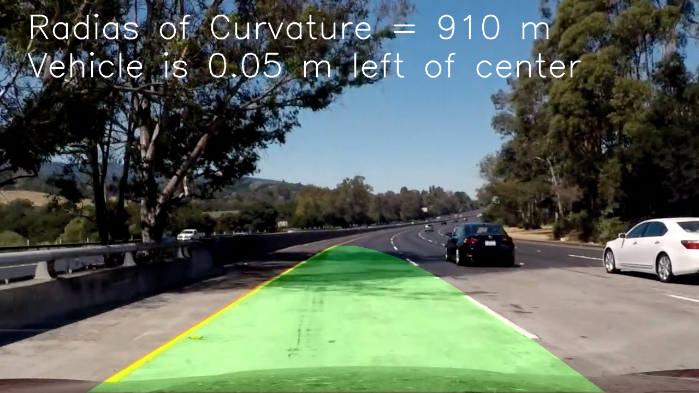
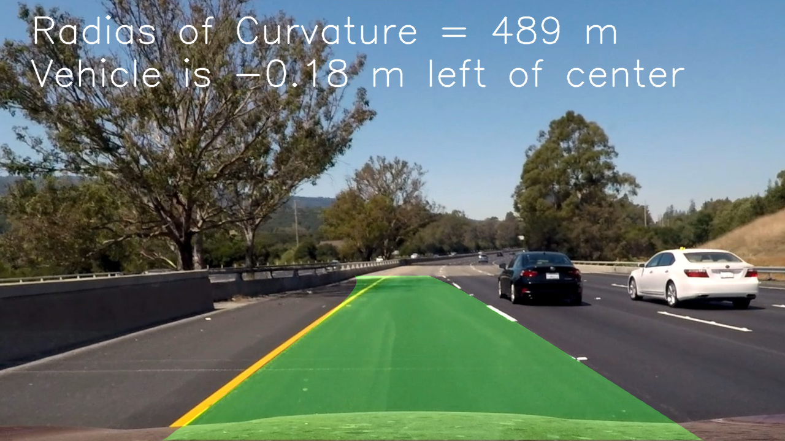


---

### Pipeline (video)

#### 1. Provide a link to your final video output.  Your pipeline should perform reasonably well on the entire project video (wobbly lines are ok but no catastrophic failures that would cause the car to drive off the road!).

Here's a [link to my video result](test.mp4)

---

### Discussion

In the warp step if the the road curvature changes rapidly the source points of the lane lines will be very different from previous ones.

Some other steps can be used to correct this problem:
- reset   
 If you lose the lines for several frames in a row, you should probably start searching from scratch using a histogram and sliding window, or another method, to re-establish your measurement.
 - Smoothing  
 Even when everything is working, your line detections will jump around from frame to frame a bit and it can be preferable to smooth over the last n frames of video to obtain a cleaner result. Each time you get a new high-confidence measurement, you can append it to the list of recent measurements and then take an average over n past measurements to obtain the lane position you want to draw onto the image.