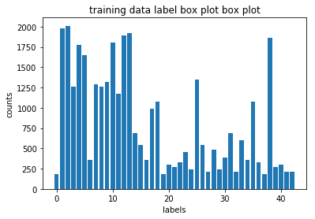
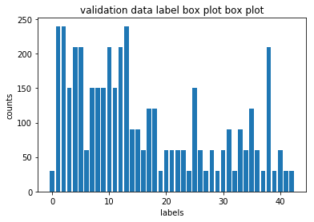
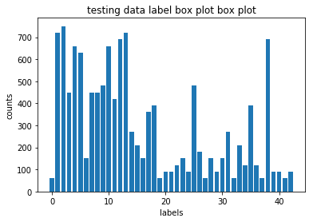
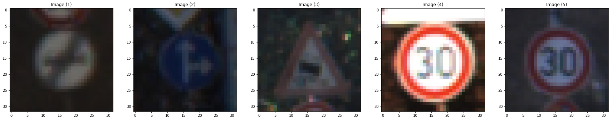
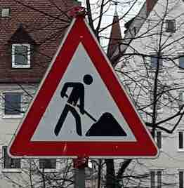
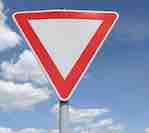
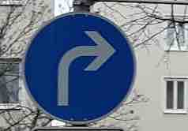
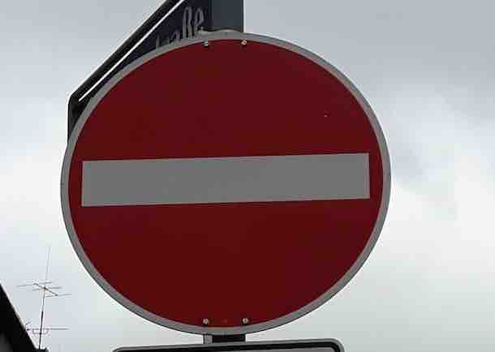

# **Traffic Sign Recognition** 

---

**Build a Traffic Sign Recognition Project**

The goals / steps of this project are the following:
* Load the data set (see below for links to the project data set)
* Explore, summarize and visualize the data set
* Design, train and test a model architecture
* Use the model to make predictions on new images
* Analyze the softmax probabilities of the new images
* Summarize the results with a written report


###  [rubric points](https://review.udacity.com/#!/rubrics/481/view)

---
### Writeup / README

### Data Set Summary & Exploration

#### 1. summary statistics of the traffic
signs data set:

* The size of training set is 34799
* The size of the validation set is 4410
* The size of test set is 12630
* The shape of a traffic sign image is (32, 32, 3)
* The number of unique classes/labels in the data set is 43

#### 2. labels distribution

The following three bar charts are showing the label distribution in each data. From the charts we can find that the labels are unevenly distributed.





#### 3. training images
Here are some training images



### Design and Test a Model Architecture

#### 1. preprocessing

I normalized the image data because it will reduce the bias and help the weights to converge.

#### 2. Model architecture

The model used here is the Yan LeCun's Lenet.

To improve the accuracy dropout was implemented to fully connected layer(fc1).

| Layer         		|     Description	        					| 
|:---------------------:|:---------------------------------------------:| 
| Input         		| 32x32x3 RGB image   							| 
| Convolution 5x5     	| 1x1 stride, valid padding, outputs 28x28x6 	|
| RELU					|												|
| Max pooling	      	| 2x2 stride,  outputs 14x14x6 				|
| Convolution 5x5	    | 1x1 stride, valid padding, outputs 10x10x16     									|
| RELU					|												|
| Max pooling	      	| 2x2 stride,  outputs 5x5x16 				|
| Fully connected		| outputs 120        							|
| RELU					|												|
| Dropout				| keep_prob 0.5        									|
| Fully connected		| outputs 84        							|
| RELU					|												|
| Fully connected		| outputs 43       							|
 


#### 3. Training.

To train the model, I used an AdamOptimizer to minimize the softmax_cross_entropy_with_logits. The other parameters batch size: (2^7), learning rate: 0.001, and epoch: 25.

#### 4. Describe the approach taken for finding a solution and getting the validation set accuracy to be at least 0.93. Include in the discussion the results on the training, validation and test sets and where in the code these were calculated. Your approach may have been an iterative process, in which case, outline the steps you took to get to the final solution and why you chose those steps. Perhaps your solution involved an already well known implementation or architecture. In this case, discuss why you think the architecture is suitable for the current problem.

My final model results were:
* validation set accuracy of 0.968
* test set accuracy of 0.946


* First, when I tried Lenet because it's a well designed model to classify patterns. The validation accuracy stays around 0.8, and it doesn't go up no matter how I tune the parameters.

* To get more than 0.93 validation accuracy, the dropout method was used to each layer with keep probability 0.5.
* Dropout can help to remove the dominant parameter effect.
* After several tries, the dropout was applied to fc1 layer.
* The epoches is set to 25 to futher improve the validation accuracy.


### Test a Model on New Images

#### 1. Five German traffic signs found on the web 

Here are five German traffic signs that I found on the web:

 

 



The last image might be difficult to classify because there are many speed limit signs. And the number of training samples of Speed limit (60km/h) sign is smaller than others. 

#### 2. Predictions on new images

Here are the results of the prediction:

| Image			        |     Prediction	        					| 
|:---------------------:|:---------------------------------------------:| 
| Road work     		| Road work   									| 
| Yield    			| Yield 										|
| Turn right ahead  	| Ahead only											|
| No entry	      		| No entry					 				|
| Speed limit (60km/h)	      		| Speed limit (50km/h)					 				|


The model was able to correctly guess 3 of the 5 traffic signs, which gives an accuracy of 0.6. This is smaller than testing accuracy 0.946. 

#### 3. Top 5 softmax

If we look at top 5 softmax, we can find the true labels are in the result but with very small probabilities.

```
True label:
[25 13 33 17  3]

Top 5 labels forecasts:
 [[25 31 21 29 24]
 [13 12 32 41 17]
 [35 34 33 40 41]
 [17 14  0 26  1]
 [ 2 35  1  3 15]] 

Top 5 probabilities forecasts:
 [[9.9950695e-01 4.9299182e-04 1.4400585e-08 1.7600848e-11 1.5705061e-11]
 [9.5574844e-01 4.4164922e-02 5.3307536e-05 3.3314111e-05 3.8106712e-08]
 [9.9997401e-01 2.0738455e-05 3.8217349e-06 7.5836186e-07 7.1042984e-07]
 [1.0000000e+00 1.4766280e-11 4.8898780e-12 1.1595354e-12 1.9912930e-14]
 [9.9999952e-01 4.4279207e-07 2.6979235e-08 1.2336737e-08 4.8326378e-09]] 
```

From the forecasts and the probabilities, we can find that even when the labels are misclassified the model is pretty sure about the result(the probabilities > 0.9). This might caused by fitting too many epoches.

| Probability         	|     Prediction	        					| 
|:---------------------:|:---------------------------------------------:| 
| .9995         			| Road work   									| 
| .9557     				| Yield  										|
| 1					|  Ahead only										|
| 1	      			| No entry					 				|
| 1				    | Speed limit (50km/h)     							|
