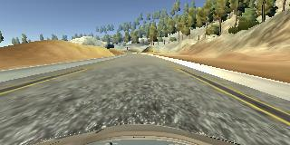
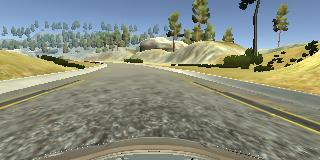
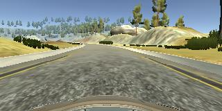
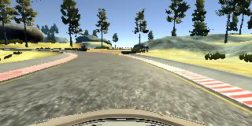
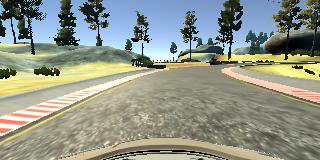
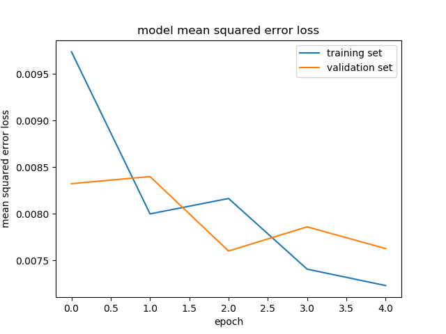

# **Behavioral Cloning** 

The goals / steps of this project are the following:
* Use the simulator to collect data of good driving behavior
* Build, a convolution neural network in Keras that predicts steering angles from images
* Train and validate the model with a training and validation set
* Test that the model successfully drives around track one without leaving the road
* Summarize the results with a written report
[rubric points](https://review.udacity.com/#!/rubrics/432/view) 

---
### Files Submitted & Code Quality

#### 1. My project includes the following files:
* train.py containing the script to create and train the model
* drive.py for driving the car in autonomous mode
* model.h5 containing a trained convolution neural network 
* README.md

#### 2. Run the code
Using the Udacity provided simulator and my drive.py file, the car can be driven autonomously around the track by executing 
```sh
python drive.py model.h5
```

### Model Architecture and Training Strategy

#### 1. An appropriate model architecture has been employed

The model used here is similar to the model used by NVDIA. It consists of a convolution neural network with 5x5 and 3x3 filter sizes and depths between 24 and 64.

Before that the I cropped the image to remove the sky and vehicle from the image.

The model includes RELU layers to introduce nonlinearity , and the data is normalized in the model using a Keras lambda layer. 

#### 2. Attempts to reduce overfitting in the model

The model was trained and validated on different data sets to ensure that the model was not overfitting. The model was tested by running it through the simulator and ensuring that the vehicle could stay on the track.

#### 3. Model parameter tuning

The model used an adam optimizer, so the learning rate was not tuned manually.

#### 4. Appropriate training data

Training data was chosen to keep the vehicle driving on the road. I used a combination of center lane driving, recovering from the left and right sides of the road and some sharpe curve training data.

For details about how I created the training data, see the next section. 

### Model Architecture and Training Strategy

#### 1. Solution Design Approach

The overall strategy for deriving a model architecture was to use simple and fast model.

My first step was to use a convolution neural network model similar to the CNN model used by NVDIA I thought this model might be appropriate because it was used by their self-driving car.

In order to gauge how well the model was working, I split my image and steering angle data into a training and validation set. I found that my first model had a low mean squared error on the training set but a high mean squared error on the validation set. This implied that the model was overfitting. 

To combat the overfitting, I used less number of epoches.

The final step was to run the simulator to see how well the car was driving around track one. The car drived well until it reached a sharp curve. To improve the driving behavior in these cases, I collect more training data of this part.

At the end of the process, the vehicle is able to drive autonomously around the track without leaving the road.

#### 2. Final Model Architecture

The final model architecture (train.py lines 49-63) consisted of a convolution neural network with the following layers and layer sizes.

| Layer         		|     Description	        					| 
|:---------------------:|:---------------------------------------------:| 
| Input         		| 160x320x3 RGB image   							| 
| Cropping         		| top 70, bottom 25   							| 
| Convolution 5x5     	| 1x1 stride, valid padding |
| RELU					|												|
| Convolution 5x5     	| 1x1 stride, valid padding |
| RELU					|												|
| Convolution 5x5     	| 1x1 stride, valid padding	|
| RELU					|												|
| Convolution 3x3     	| 1x1 stride, valid padding |
| RELU					|												|
| Convolution 3x3     	| 1x1 stride, valid padding |
| RELU					|												|
| Fully connected		| outputs 100        							|
| Fully connected		| outputs 50        							|
| Fully connected		| outputs 10        							|
| Fully connected		| outputs 1        							|

#### 3. Creation of the Training Set & Training Process

To capture good driving behavior, I first recorded two laps on track one using center lane driving. Here is an example image of center lane driving:



I then recorded the vehicle recovering from the left side and right sides of the road back to center so that the vehicle would learn to get back to center. These images show what a recovery looks like starting from right to center :

  




Then I repeated this process on track two in order to get more data points.

To augment the data sat, I also flipped images and angles thinking that this would generalize the behavior to both directions. For example, here is an image that has then been flipped:

  




After the collection process, I had 8422 number of data points. I then preprocessed this data by cropping top 70 and bottom 25 pixels. 

I finally randomly shuffled the data set and put 20% of the data into a validation set. 

I used this training data for training the model. The validation set helped determine if the model was over or under fitting. The ideal number of epochs was 3 as evidenced by the visulization I used an adam optimizer so that manually training the learning rate wasn't necessary.


