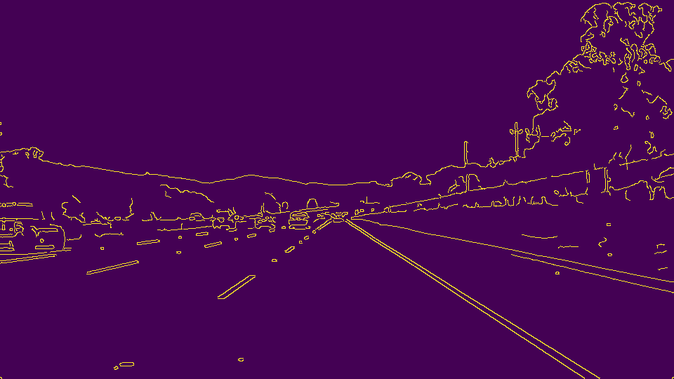
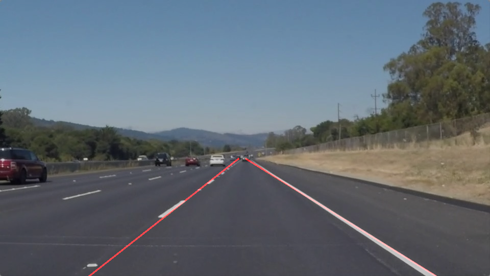

# **Finding Lane Lines on the Road** 
---

**Finding Lane Lines on the Road**

The goals / steps of this project are the following:
* Make a pipeline that finds lane lines on the road
* Reflect on your work in a written report

---

### Reflection

### 1. Pipeline details
**Please look into P1.ipynb file for the details**  
My pipeline consisted of 6 steps. 
1. gray scale  
 
2. gaussian bluring

3. canny function for edge detection

4. set the region of interest  

5. Hough Tranform line detection

6. draw the line

### 2. The potential shortcomings with current pipeline

1. This function sometimes draw multiple lines instead of single line.
2. When the image has high exposures, it can't detect the line.

### 3. The possible improvements to current pipeline

1. Tune the parameters more carefully.
2. Add some other image processing steps to handle the special cases