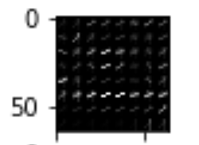
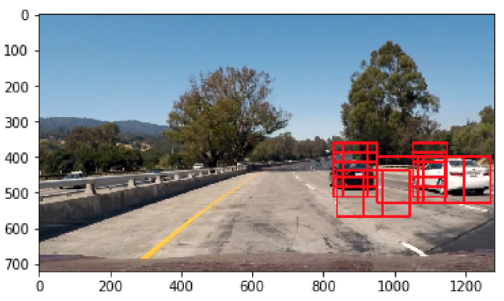
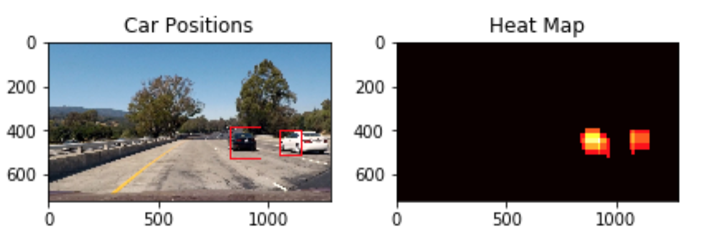

**Vehicle Detection Project**
---

The goals / steps of this project are the following:

* Perform a Histogram of Oriented Gradients (HOG) feature extraction on a labeled training set of images and train a classifier Linear SVM classifier
* Optionally, you can also apply a color transform and append binned color features, as well as histograms of color, to your HOG feature vector. 
* Note: for those first two steps don't forget to normalize your features and randomize a selection for training and testing.
* Implement a sliding-window technique and use your trained classifier to search for vehicles in images.
* Run your pipeline on a video stream (start with the test_video.mp4 and later implement on full project_video.mp4) and create a heat map of recurring detections frame by frame to reject outliers and follow detected vehicles.
* Estimate a bounding box for vehicles detected.

* [Rubric](https://review.udacity.com/#!/rubrics/513/view)

### Histogram of Oriented Gradients (HOG)

#### 1. Extracted HOG features from the training images.

The code for this step is contained in the third code cell of the "Vehicle Detection .ipynb" IPython notebook.  

I started by reading in all the `vehicle` and `non-vehicle` images.  Here is an example of one of each of the `vehicle` and `non-vehicle` classes:

 

I then explored different color spaces and different `skimage.feature.hog()` parameters (`orientations`, `pixels_per_cell`, and `cells_per_block`).  I grabbed random images from each of the two classes and displayed them to get a feel for what the `skimage.hog()` output looks like.

Here is an example using the `HLS` color space and HOG parameters of `orientations=8`, `pixels_per_cell=(8, 8)` and `cells_per_block=(2, 2)`:

#### 2. Settled on your final choice of HOG parameters.

I tried various combinations of parameters and find that `orientations=8`, `pixels_per_cell=(8, 8)` and `cells_per_block=(1, 1)` provides enough information and short running time.

#### 3. Train a classifier using your selected HOG features.

I trained a linear SVM using linear kernel. Codes are in the 5th cell of IPython notebook.

### Sliding Window Search

#### 1. Implemented a sliding window search. 

I start with the window size (96, 96) and xy_overlap (0.5, 0.5). Then I found this could not find all the vehicles. So I added (128, 128) window and increased the xy_overlap to (0.7, 0.7). To reduce the false positive I hardcoded the regions of interest.

#### 2. Test on images

Ultimately I searched on two scales using HLS S-channel HOG features without usingspatially binned color and histograms of color(cell 8 and9 and more EDA is in the EDA.ipynb file). Because saturation channel has great information which can seperate vehicles from background. Then I get this result with many duplicates.

To remove the duplicates and false positives I used heatmap of overlapping result more than threshold 2.

---

### Video Implementation

#### 1. Link to my video output.  
Here's a [link to my video result](./output_video.mp4)

#### 2. Filter for false positives and some method for combining overlapping bounding boxes.

To further filter the duplicates and false positives, I recorded the positions of positive detections in each frame of the video.  From the positive detections I created a heatmap and then thresholded that map to identify vehicle positions. For each 30 frames I only kept the ovelapping parts of more than 30 windows. I then used `scipy.ndimage.measurements.label()` to identify individual blobs in the heatmap.  I then assumed each blob corresponded to a vehicle. I constructed bounding boxes to cover the area of each blob detected.  

---

### Discussion

#### 1. Briefly discuss any problems / issues you faced in your implementation of this project.  Where will your pipeline likely fail?  What could you do to make it more robust?

Smoothing 30 frames for 60 fps video means 0.5 sec. During this time, if any speeding vehicles apear on the road, this model might not be able to detect it. This probably will cause accident.
